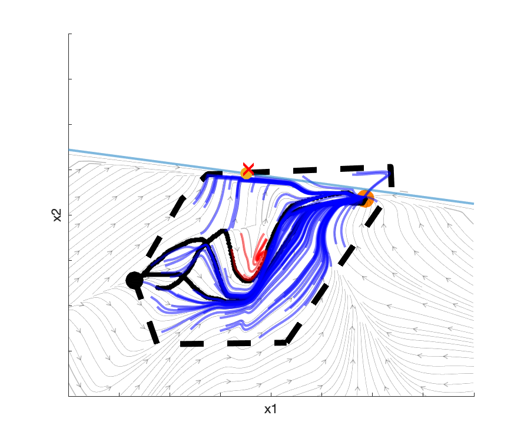

# Temporal Logic Imitation (TLI)

Matlab implementation of paper [Temporal Logic Imitation: Learning Plan-Satisficing Motion Policies from Demonstrations (CoRL2022 Oral)](https://yanweiw.github.io/tli/). Python implementation to come!

## Setup 
**Clone this repo**
```
git clone https://github.com/yanweiw/tli.git
cd tli
```
**Install dependencies**

Install Matlab, and for the first time compile third party softwares by running 
```
setup_code 1
```
If the compilation results in issues, (e.g. Error using mex when installing lightspeed) you will most likely need to update the link to compilers on your system in file `tli/ds-libraries/thirdparty/lightspeed/install_lightspeed.m`

Once the compilations are successful, run the following to initialize matlab workspace everytime matlab is restarted)
```
setup_code
```

## Runing code
**Reproducing multi-modal replanning videos**

Successful policy rollouts in the following toy example requires going through the white, yellow, pink and green regions (modes) consecutively. Leaving any colored region (a.k.a. invariance failures, shown by streamlines flowing out of a colored region) due to perturbations requries restarting in the white region. An imitation policy can get stuck switching between modes if it is not modulated by encountered invariance failures, while modulating mode-based policy with cutting planes prevents future invariance failures.
LTL-DS without modulation  |  LTL-DS with modulation
:-------------------------:|:-------------------------:
  |  

1. Go to `dsltl.m` and run the very first section with `seed=0` corresponding to the existing experiment in `experiments/scoop_seed_00`. 
2. Run the section `Load DS` that loads pre-learned DS. Six figures will show: original demos, original unsegmented demos overlayed with the corresponding learned DS, demos after segmentation, and individual DS corresponding to each segmented demo. 
3. Run the section `Simulation`. For multi-modal nominal policy, set ```opt_sim.if_mod=0```. For multi-modal modulated policy, set ```opt_sim.if_mod=1```. To perturb the policy, drag your mouse around. 

**Generating new data**

1. Go to `dsltl.m` and set `seed` to a different number than the exisiting trials in the `experiments` folder. Update `do_erase_exp=1`.
2. Run first two sections (up to `Draw 2D Dataset with GUI`) and a GUI will pop up. Drag your mouse to draw one or multiple demonstrations and click the `Store Data` button at the end
3. Run the section `Segment Data` and `Run Learning`, two images will show up: the unsegmented data (now shifted such that all trajectories end in the same attractor) and segmented data according to the AP regions. These are the processed data used for learning. 
4. Run the section Load DS, and the learning results of both the unsegmented data and segmented data will appear. 
5. Run the section `Simulation`. For multi-modal nominal policy, set ```opt_sim.if_mod=0```. For multi-modal modulated policy, set ```opt_sim.if_mod=1```. To perturb the policy, drag your mouse around. 

**Reproducing single mode BC vs DS videos**

Given successful demonstrations of reaching a goal location in red, a learned BC policy does not guarantee goal-reaching due to spurious attractors or diverging flows in regions without data coverage, while a learned DS policy guarantees goal-reaching due to its global stability at the attractor.
BC policy  |  DS policy
:-------------------------:|:-------------------------:
  |  

1. To interact with a pre-trained BC/DS policy, run in the matlab command window
```
bc_vs_ds('bc'/'ds')
```
2. To learn DS from the new data generated, follow the previous section.
3. To learn BC from the new data generated, run `learn_bc_interactive.m` after setting the intended `experiment` folder.
4. To interact with the newly learned BC/DS policy, run
```
bc_vs_ds('bc'/'ds', 'new_experiment_name') 
```

**Reproducing single mode analysis videos**

|Boundary estimation by cutting planes|
|-------------------------------------|
||

1. To generate the video above, go to `single_mode.m`, and set `seed` to 0 to locate the pre-trained experiment folder, and run the first section.
2. Skip the drawing, DS learning and BC learning sections, and run `Load DS` and `Load BC` to load pre-trained policies.
3. Run `Simulate` and `Interactive Simulation` to interact with either the BC or DS policy.
4. To generate new convex shapes and collect new data, run `Draw 2D Dataset with GUI`, `Load Drawn Data, Learn and Save DS`, and `Load Drawn Data, Learn and Save BC`. 

| DS rollouts under OOD perturbations | Modulated DS rollouts under OOD perturbations |
| ---------------------------|-------------------------|
|   |   |

DS learned from successful demonstrations (in black) exhibit only invariance failures (red) when perturbed to out-of-distribution states. DS modulated by cutting planes learned from past invariance failures guarantees successful rollouts (blue) that are both goal-reaching (arrive at the orange circle) and mode-invariant (stay inside the mode boundary). 
 
| BC rollouts under OOD perturbations | Modulated BC rollouts under OOD perturbations
| ----------------------------------------|-------------------------|
|   |   | 

BC learned from successful demonstrations (in black) exhibit both invariance and reachability failures (red) when perturbed to out-of-distribution states. BC modulated by cutting planes is cured of invariance failures but still suffers from reachability failures (red) where the rollouts get stuck in spurious attractors. 

5. To generate the above analysis, proceed to run section `Batch Simulate` in `single_mode.m` for unmodulated results of BC vs DS.
6. To generate the modulated results of BC vs DS, run section `Batch Simulate with Modulation`. 

**Translating LTL formulae to replannable automaton**
1. Install [Spot](https://spot.lre.epita.fr/install.html)
2. We show here how an LTL formula written in the [Spot format](https://spot.lre.epita.fr/ipynb/formulas.html) can be translated into an operationable automaton that replans a discrete mode sequence based on sensor measurements in python. 
3. For the scooping task with mode transitions `a->b->c->d`, run default formula in `python plan_from_ltl.py -s 0`. This program simulates perturbations at the task discrete level, and the output format--`{curr_mode}_{sensor_measurement}->{next_mode}`--shows how a sensor measurement (e.g. `100` indicates sensor `r` is `True`, sensor `s` is `False`, sensor `t` is `False`), the planner advances to the next mode from the current mode. Giving different random seeds with option `-s` result in different perturbation patterns. 

4. To try different formulas, please consider option `-f`, `-i`, `-p` as documented in the python file.